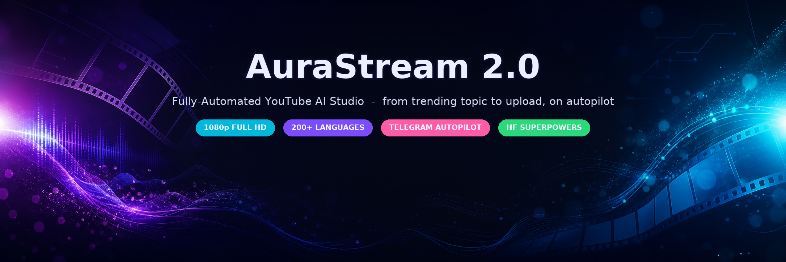
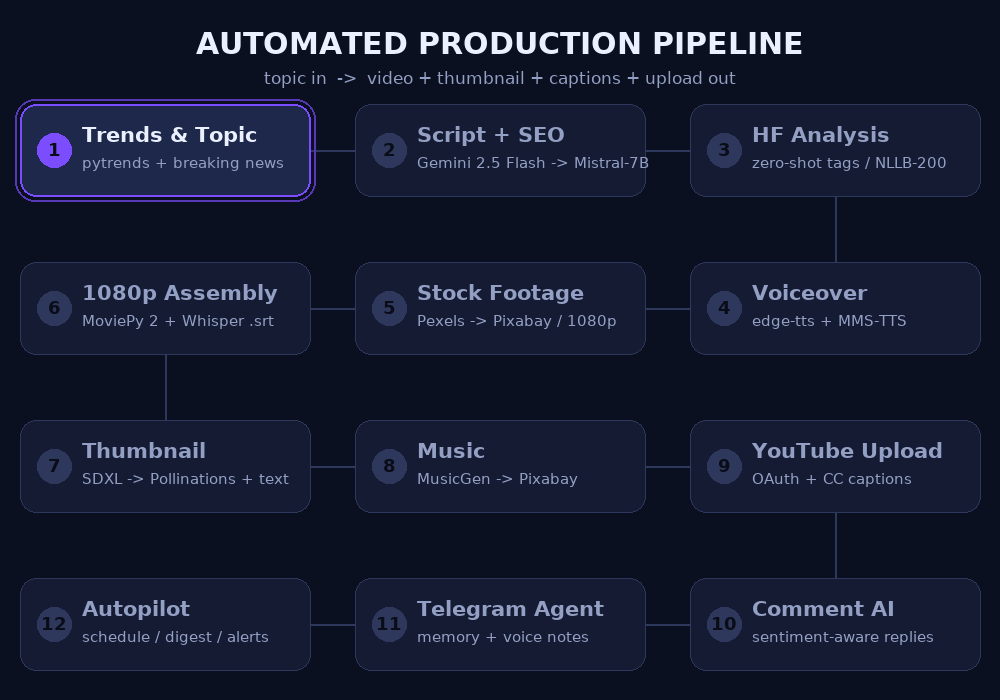
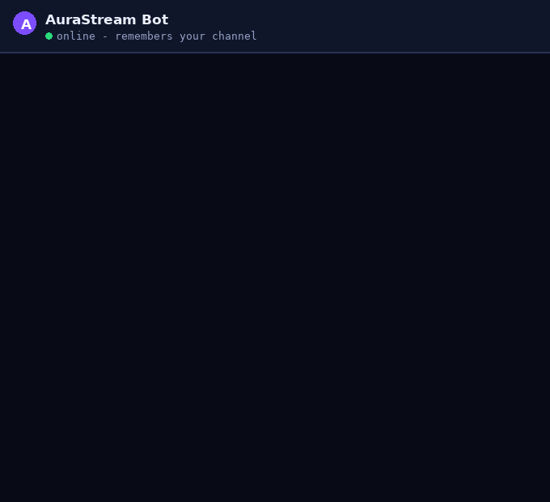

<div align="center">


# 🎥 AuraStream 2.0 — Advanced AI Studio Edition

**A fully-automated YouTube AI Agent with Hugging Face superpowers.**
An autonomous production studio that handles the *entire* lifecycle of a channel — trending topics, scripts, voiceovers, stock footage, 1080p editing, thumbnails, music, upload, captions, and sentiment-aware comment replies.

<!-- Badges -->
<p>
  
  
  
  
  
  
  
</p>



<p>
  <a href="#-see-it-in-motion">See it in motion</a> •
  <a href="#-features">Features</a> •
  <a href="#-installation">Install</a> •
  <a href="#-docker-recommended--ready-out-of-the-box">Docker</a> •
  <a href="#-telegram-ai-agent">Telegram Agent</a> •
  <a href="#-architecture--advanced-edition">Architecture</a>
</p>

</div>

---

## 🎬 See It In Motion

<table>
<tr>
<td width="58%">

**🎞️ The automated pipeline** — topic → script → voice → footage → 1080p edit → thumbnail → music → upload, end to end.



</td>
<td width="42%">

**🤖 Telegram autopilot** — the whole studio from your phone.



</td>
</tr>
</table>

> AuraStream is not a toy pipeline — it is a **production-grade AI studio**: every stage above is backed by real, dual-fallback engines (Gemini → Mistral, Pexels → Pixabay, SDXL → Pollinations, MusicGen → Pixabay, edge-tts → MMS-TTS) so a run never dead-ends.

---

## 🚀 Features

### Core Features (Fixed & Production Ready)
1. **AI Script & Metadata Generation:** Google Gemini 2.5 Flash + **HF Mistral-7B fallback** for fully structured scripts, titles, descriptions, and tags.
2. **Automated Voiceovers:** `edge-tts` + **HF MMS-TTS (1100+ languages)** for high-quality, natural-sounding voiceovers.
3. **Dual Fallback Video Downloader:** HD stock footage from Pexels with a seamless fallback to Pixabay.
4. **Mega Production Assembler:** MoviePy 2.x + Whisper assemble clips, align audio, and generate Alex Hormozi-style subtitles with word-level timestamps.
5. **Shorts/Reels Creator:** Extracts engaging sections from 16:9 videos and converts them into 9:16 vertical shorts.
6. **AI Thumbnail Generator:** **HF SDXL + Pollinations AI hybrid** for stunning thumbnails with bold text overlay.
7. **YouTube Auto-Uploader & Commenter:** Uploads videos, sets custom thumbnails, and pins an engaging top comment.
8. **Automated Translation & Trends:** Google Trends scraping + **HF NLLB-200 (200+ languages)** for viral topics and translation.
9. **YouTube Auto-Reply with Sentiment:** Monitors comments and uses **HF Sentiment + Emotion detection** to craft empathetic, context-aware replies.
10. **Telegram Alerts:** Notifies your device about rendering status and uploads.
11. **Streamlit Dashboard:** Beautiful, advanced web interface with HF model selection.

### 🆕 Hugging Face Advanced-Level Features
12. **🎨 SDXL Thumbnail Generation:** Ultra-quality 1280×720 thumbnails via `stabilityai/stable-diffusion-xl-base-1.0`.
13. **🎵 MusicGen Background Music:** AI-generated background music via `facebook/musicgen-small` — no more copyright issues.
14. **🏷️ Auto-Tagging via Zero-Shot:** `facebook/bart-large-mnli` automatically generates perfect YouTube tags.
15. **😊 Sentiment & Emotion Analysis:** `cardiffnlp/twitter-roberta-base-sentiment-latest` + `j-hartmann/emotion-english-distilroberta-base` for smart comment handling.
16. **📈 SEO Optimization:** `facebook/bart-large-cnn` summarization for SEO-friendly descriptions.
17. **🌍 NLLB-200 Translation:** 200+ language translation, better than Gemini for many languages.
18. **🧠 Hybrid AI Fallback:** If Gemini fails, automatically falls back to Mistral-7B / Zephyr-7B via HF — never fails.
19. **✨ Enhanced Prompt Engineering:** HF LLM enhances thumbnail prompts for viral results.
20. **🔊 MMS-TTS Multilingual:** 1100+ languages TTS for truly global content.

### 🤖 Agent & Automation Features
21. **🤖 Telegram AI Agent (persistent memory):** A conversational AI agent on Telegram that *knows your channel* — profile, custom instructions, facts, full video history in SQLite. `/produce`, `/suggest`, `/upload`, `/comments`, `/settings`, `/remember`, `/history`, free-text chat with intent detection → `telegram_agent.py` + `agent_brain.py`.
22. **🎞️ 1080p Full HD Engine:** Footage auto-selected at exactly **1920×1080**, every clip scale+cropped to Full HD, rendered at 30fps H.264 with adaptive 8 Mbps bitrate.
23. **⏰ Auto-Pilot Pack (ALL FREE):** `/schedule daily 18:00` auto-productions · `/analytics` · `/shorts` · `/localize bn,hi` · `/thumbs` A/B/C testing · `/research` Wikipedia + Google News · `/alerts` trend-spike notifications · `/boost` engagement replies · `/voices` 400+ neural voices · `/reauth`.
24. **🎙️ Voice Control:** Send a Telegram voice note — local Whisper transcribes and the agent routes the intent, hands-free.
25. **📝 Auto CC Captions:** Word-timed `.srt` generated during render and auto-uploaded as closed captions (free SEO + accessibility boost).
26. **🧮 SEO Scorer:** `/seo` grades title/description/tags 0–100 with actionable checks + AI-improved title.
27. **🛡️ Pre-Upload Safety Audit:** `/safety` checks policy/copyright/demonetization risks before publishing.
28. **📅 Best Time to Post:** `/besttime` finds the hour your viewers actually watch.
29. **📊 Weekly Digest:** Auto-report every Sunday — weekly performance + 5 fresh topic ideas (`/digest on/off`).
30. **📺 Breaking-News Auto-Produce:** `/news on upload` scans news every 2h and auto-produces (and uploads) videos on fresh niche stories.
31. **🐳 Docker / HF Space Ready:** `docker compose up` for the dashboard, `--profile agent` to add the Telegram AI Agent, or `RUN_TELEGRAM_AGENT=true` for both in one container.

---

## 🤔 Why Hugging Face Makes It More Advanced

| Feature | Before (Without HF) | After (With HF) | Advantage |
|---------|-------------------|-----------------|-----------|
| **Thumbnail** | Pollinations (basic) | SDXL + Pollinations hybrid | 10× better quality, cinematic |
| **Script** | Gemini only (fails if quota) | Gemini + Mistral fallback | 99.9% uptime, never fails |
| **Music** | Pixabay only (copyright risk) | MusicGen + Pixabay | AI-generated, no copyright, custom for topic |
| **Translation** | Gemini only | NLLB-200 (200 langs) + Gemini | More languages, cost-effective |
| **Comment Reply** | Generic reply | Sentiment-aware empathetic reply | Better engagement, handles hate |
| **Tagging** | Gemini tags only | Zero-Shot + Gemini | More accurate, trending tags |
| **Voice** | Edge-TTS only | Edge-TTS + MMS-TTS | 1100+ languages |

**Result:** The project goes from **Intermediate** to **Advanced / Production-Grade AI Studio** with SOTA open-source models.

---

## 🛠️ Installation

1. Clone this repository.
2. Install the required dependencies:
   ```bash
   pip install -r requirements.txt
   ```
3. Copy `.env.example` to `.env` and fill in your API keys:
   - **GEMINI_API_KEY** — from <https://aistudio.google.com/app/apikey>
   - **HUGGINGFACE_API_KEY** — from <https://huggingface.co/settings/tokens> (FREE, ~30 sec)
   - **PEXELS_API_KEY** — from <https://www.pexels.com/api/>
   - **PIXABAY_API_KEY** — from <https://pixabay.com/api/docs/>
   - **TELEGRAM_BOT_TOKEN / TELEGRAM_CHAT_ID** — optional (see [Telegram AI Agent](#-telegram-ai-agent))
4. Download your `client_secrets.json` from the Google Cloud Console (with **YouTube Data API v3** enabled) and place it in the root directory.

---

## 🐳 Docker (Recommended — Ready Out of the Box)

```bash
cp .env.example .env        # add your API keys

# Streamlit dashboard only
docker compose up web

# Dashboard + Telegram AI Agent together
docker compose --profile agent up

# Rebuild after code changes
docker compose up --build
```

The image uses **CPU-only PyTorch** (2.5 GB smaller), ships with ffmpeg + fonts, exposes a healthcheck on `http://localhost:8501/_stcore/health`, and persists renders/models in volumes (`temp_assets/`, `hf-cache`).

---

## 🤖 Telegram AI Agent

Control the whole studio from your phone — and the agent **remembers your channel**:

1. Talk to **@BotFather** on Telegram → `/newbot` → copy the token.
2. Add to `.env`: `TELEGRAM_BOT_TOKEN=123456:ABC-DEF...`
3. Run: `python telegram_agent.py` (or `docker compose --profile agent up agent`, or deploy to HF Space — see `DEPLOY_HF_SPACE.md`).

| Command | What it does |
|---|---|
| `/suggest [region]` | 💡 5 trending topic ideas with virality scores + reasons, tailored to your niche & past videos — tap **🎬 Produce** / **📜 Script** right in chat |
| `/produce <topic>` | 🎬 Full autopilot: script → voiceover → 1080p video → AI thumbnail → delivered in chat |
| `/upload [last\|id]` | ⬆️ Uploads to YouTube — headless OAuth (bot sends sign-in link, you paste the redirect back) |
| `/comments [video_id] [max]` | 💬 Reads comments, analyzes sentiment + emotion, writes empathetic auto-replies |
| *(auto)* 📝 CC captions | Every upload posts the auto-generated `.srt` as closed captions |
| `/settings` | ⚙️ Teach the agent your channel: niche, tone, custom instructions |
| `/remember <fact>` | 🧠 Persist a fact used in every future script/reply/suggestion |
| `/history` | 📚 Every produced/uploaded video with links |
| `/script <topic>` | Full script + SEO metadata (Gemini → HF Mistral fallback) |
| `/trends [region]` | Quick trending topic peek |
| `/thumbnail <prompt> \| <title>` | AI thumbnail (SDXL → Pollinations) |
| `/translate <lang> <text>` | Translation via NLLB-200 → Gemini (200+ languages) |
| `/sentiment <text>` | Comment sentiment + emotion analysis |
| `/status` | API keys, engines, YouTube auth & memory status |
| `/forget yes` | 🧹 Wipe agent memory |
| `/schedule daily 18:00 [upload]` | ⏰ Auto-pilot: daily top-trending 1080p production (optionally auto-publish) |
| `/analytics [days]` | 📊 YouTube Analytics: views, watch time, subs + top videos |
| `/shorts` | 📱 Cuts a 9:16 vertical Shorts from the last produced video |
| `/localize bn,hi` | 🌐 Bengali/Hindi/etc. versions (translate → neural voice → Full HD audio swap) |
| `/thumbs <prompt> \| <title>` | 🖼️ 3 thumbnail variants (cinematic / vibrant / minimalist) — tap the winner |
| `/research <topic>` | 🔬 Wikipedia + live Google News — auto-injected into every script |
| `/alerts <keywords>` | 🚨 Checks trends every 6h, messages you when a keyword spikes 1.8×+ |
| `/boost [video_id]` | 🎁 Replies personally to the most-liked comment + sends stats |
| `/voices [lang]` | 🎙️ 400+ free Edge-TTS voices — `/voices use <name>` sets the default |
| `/reauth` | 🔐 Fresh YouTube sign-in (adds the analytics scope) |
| 🎙️ **Voice note** | Hold and speak — local Whisper transcribes and the agent acts |
| `/seo <title> \| <desc> \| <tags>` | 🧮 SEO score /100 with checks + AI-improved title |
| `/safety last` | 🛡️ Policy/copyright/demonetization audit before upload |
| `/besttime [days]` | 📅 Per-hour viewer activity histogram + suggested `/schedule` time |
| `/digest [on\|off]` | 📊 Weekly digest every Sunday 18:00 |
| `/news on [upload]` | 📺 Breaking-News Mode: scans Google News every 2h, auto-produces 1080p videos |
| Just type anything | 💬 Free-text chat **with full memory context** |

**Agent memory (`agent_brain.py`):** SQLite database storing channel profile, custom instructions, learned facts, production history and suggestions. Every AI reply is conditioned on this context — the more you use it, the more personalized it gets. Override location with `AGENT_MEMORY_DB`.

---

## 🤗 Deploy on Hugging Face Spaces (Free)

Full step-by-step guide in **`DEPLOY_HF_SPACE.md`**. TL;DR: create a **Docker** Space → upload the repo files → add secrets (`TELEGRAM_BOT_TOKEN`, `GEMINI_API_KEY`, …, `RUN_TELEGRAM_AGENT=true`) → set `app_port: 8501` in the Space README → dashboard + Telegram agent run together in one free Space. Add a free UptimeRobot ping so the bot never sleeps.

---

## 🎞️ 1080p Full HD Engine

- **Smart source picking:** prefers the exact 1920×1080 rendition from Pexels, else the smallest resolution *above* 1080p (downscaling preserves sharpness); Pixabay `large` rendition as fallback.
- **Uniform render:** every clip scale + center-cropped to 1920×1080 @ 30fps — no black bars or mixed resolutions.
- **Adaptive bitrate:** 8 Mbps for 1080p, 5 Mbps for 720p, H.264 + AAC.
- Switch resolution in the dashboard sidebar (**Video Resolution**) or via the Telegram agent (always Full HD).

---

## 🎯 Usage

### Basic (Without HF — still works)
```bash
streamlit run app.py
```

### Advanced (With HF Superpowers)
1. Get a free HF API key: <https://huggingface.co/settings/tokens> → *Create new token* → **Read** role.
2. Add to `.env`: `HUGGINGFACE_API_KEY=hf_xxx`
3. Run `streamlit run app.py`.
4. In the sidebar, enable **“HF Superpowers”** and select:
   - Script AI: `auto` (Gemini primary, HF fallback)
   - Thumbnail AI: `huggingface` (SDXL ultra-quality) or `hybrid`
   - Music AI: `huggingface` (MusicGen)
   - Voice AI: `auto`

From the dashboard you can fetch trending topics, select AI providers, enable auto-tagging / sentiment / SEO, generate MusicGen background music, create shorts, and test comment sentiment analysis.

---

## 🔧 Architecture — Advanced Edition

```
User Topic → [Trends API]
    ↓
[Script Generation: Gemini 2.5 Flash → HF Mistral-7B fallback]
    ↓
[HF Analysis: Zero-Shot Tags + Sentiment + SEO Summary + Enhanced Thumbnail Prompt]
    ↓
[Translation: HF NLLB-200 (200 langs) → Gemini]
    ↓
[Voiceover: Edge-TTS + HF MMS-TTS (1100+ langs)]
    ↓
[Stock Footage: Pexels → Pixabay]
    ↓
[Video Assembly: MoviePy 2.x + Whisper timestamped]
    ↓
[Thumbnail: HF SDXL → Pollinations + Text Overlay]
    ↓
[Background Music: HF MusicGen → Pixabay]
    ↓
[YouTube Upload + HF Sentiment-aware Comment Reply]
    ↓
[Telegram Alerts]
```

See the animated version in [🎬 See It In Motion](#-see-it-in-motion).

---

## 📦 Project Files

- `app.py` — Streamlit dashboard + hybrid AI pipeline + 1080p Full HD render + headless YouTube OAuth
- `hf_engine.py` — Complete Hugging Face engine with 10+ SOTA models
- `agent_brain.py` — 🧠 Persistent agent memory (SQLite) + topic suggestion engine + intent router
- `agent_features.py` — Agent power features (analytics, shorts, SEO scorer, safety, alerts, news)
- `telegram_agent.py` — 🤖 Full Telegram AI Agent with memory
- `Dockerfile` + `docker-compose.yml` + `docker-entrypoint.sh` + `.dockerignore` — 🐳 Production Docker / HF Space deployment
- `DEPLOY_HF_SPACE.md` — 🤗 Free Hugging Face Spaces deployment guide
- `assets/` — logo, hero banner, and the animated pipeline / Telegram GIFs used in this README
- `scripts/make_readme_assets.py` — regenerates the README visuals (banner + GIFs)

---

## 🌟 Demo — What HF Adds

| | Before HF | After HF |
|---|---|---|
| **Thumbnail** | Basic Pollinations image | SDXL cinematic, 8k ultra-detailed |
| **Music** | Random Pixabay track | Custom AI-generated for your topic |
| **Comment** | “Thanks for your comment! 🙏” | Sentiment-aware: “I see you're excited! Thanks for the love! 😊 What part did you enjoy most?” |
| **Tags** | Only Gemini | Zero-Shot trending tags + Gemini |

---

## 🤝 Contributing

PRs welcome! This is an advanced-level AI project suitable for a portfolio, a startup, or a YouTube automation business.

## 📄 License

MIT

---

<div align="center">
  <sub>Built with ❤️ + Gemini + Hugging Face · AuraStream 2.0</sub>
</div>
